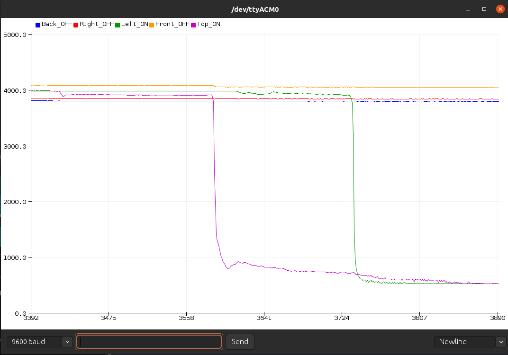

# Examples

## Custom Firmware
Default firmware that comes preload with the package. Its main function is to use as an external keyboard with shortcuts to increase your productivity in your daily work in the computer.
Each face is mapped with a possible combination of 3 keys, and a color to show that the keys were sent.
These can be remapped via the [web interface](https://cubetouch.noteolvid.es/keyRemapping/) thanks to [web serial](https://web.dev/serial/).

<details>
  <summary>Check the code 🖥</summary>

  ```cpp reference
  https://github.com/Noteolvides/CubeTouch/blob/main/Examples/CustomFirmware/CustomFirmware.ino
  ```

</details>

## Easy RGB
A simple example that receives an RGB hex value and displays it.
Send hex color to the Serial Monitor following this format (R,G,B): #0B4F02

<details>
  <summary>Check the code 🖥</summary>

  ```cpp reference
  https://github.com/Noteolvides/CubeTouch/blob/main/Examples/EasyRGB/EasyRGB.ino
  ```

</details>

<div className="container">
  <div className="row" style={{alignItems: "center"}}>
    
    
  </div>
</div>

## Chasse Text
No configuration, just upload the sketch and enjoy the beautiful colors.
<details>
  <summary>Check the code 🖥</summary>

  ```cpp reference
  https://github.com/Noteolvides/CubeTouch/blob/main/Examples/ChasseTest/ChasseTest.ino
  ```

</details>


<div style={{display: "flex", justifyContent: "center"}}>
  <video autoPlay muted loop src={require('./assets/ChaseTest.mp4').default}/>
</div>

## Touch Graph
A simple sketch that plots all the values coming from the 5 capacitive buttons.

<details>
  <summary>Check the code 🖥</summary>

  ```cpp reference
  https://github.com/Noteolvides/CubeTouch/blob/main/Examples/TouchGraph/TouchGraph.ino
  ```

</details>




## CDC and Keyboard
This example echoes the next character of data it receives via the serial monitor and sends as a key also the next character send.

<details>
  <summary>Check the code 🖥</summary>

  ```cpp reference
  https://github.com/Noteolvides/CubeTouch/blob/main/Examples/CDC_KEYBOARD/CDC_KEYBOARD.ino
  ```

</details>


<div className="margin-bottom--lg" style={{display: "flex", justifyContent: "center"}}>
  <video style={{width: "100%"}} autoPlay muted loop src={require('./assets/CDC_KEYBOARD.mp4').default}/>
</div>


> :warning: This example needs to be compiled with a **USER USB** setting
> Tools--> USB Settings--> USER CODE w/148 USB Ram

## Custom bootloader
This example that shows how to jump to the bootloader address to make it reprogrammable.
You can send the character B, or connect the pin 11 to GND.

<details>
  <summary>Check the code 🖥</summary>

  ```cpp reference
  https://github.com/Noteolvides/CubeTouch/blob/main/Examples/CustomBootloader/CustomBootloader.ino
  ```

</details>


