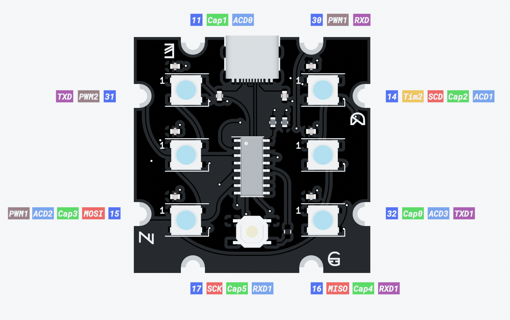

# Hardware

## Pinout

## BOM
| **Qty** |     **Value**     | **LCSC** |        **Reference(s)**        |
|:-------:|:-----------------:|:--------:|:------------------------------:|
|    8    |  Capacitor 0,1uf  |  C14663  | C1, C2, C3, C4, C5, C6, C7, C8 |
|    6    |      WS2812B      |  C139127 |     D1, D2, D3, D4, D5, D6     |
|    1    |       USB_C       |  C709357 |               J1               |
|    2    |   Resistor 5.1K   |  C25905  |             R1, R2             |
|    1    |    Resistor 10K   |  C25197  |               R3               |
|    1    | SW Tactile Button |  C318884 |               SW1              |
|    1    |       CH554G      |  C114295 |               U1               |
## Schematics
<embed src="http://www.africau.edu/images/default/sample.pdf" width="100%" height="375" type="application/pdf"/>

## PCB'S

### Top

  

    
    
  

### Bottom

  

    
    
  

### Left

  

    
    
  

### Right

  

    
    
  

### Front

  

    
    
  

### Back

